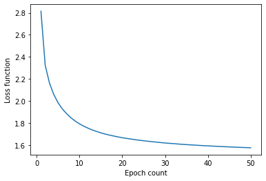
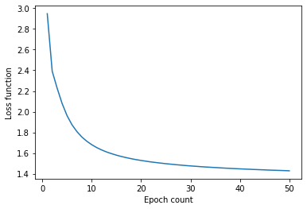
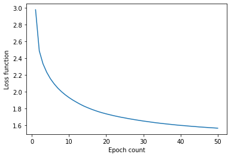

# Отчет по лабораторной работе "Генерация последовательностей"

## ФИО, Группа
Петросян Виктор Арменович, М8О-308Б-17\
Номер в группе: 15, Вариант: 3

## Цель работы

Построит char-level языковые модели генерации текста на основе различных архитектур нейронных сетей: обычной полносвязной RNN, однослойной GRU, однослойной LSTM, двухслойной LSTM.

## Используемые входные данные

Для обучения я решил воспользоваться пятью самыми популярными книгами на ресурсе  https://www.gutenberg.org/, однако одна из них была не на английском языке, поэтому огранился четырьмя текстами. Наверное, стоило бы взять большее количество данных, но зато было удобно наблюдать за обучением сетей, и подбирать гиперпараметры(кол-во юнитов в рекуррентных сетях).

## Предварительная обработка входных данных

Текст избавлен от цифр и приведен к нижнему регистру. Пунктуация оставлена из-за интереса посмотреть на попытку моделирования языка.


## RNN

#### Архитектура сети

```
tf.keras.Sequential([
        tf.keras.layers.Embedding(vocab_size, emb_dim, batch_input_shape=[batch_size, None]),
        tf.keras.layers.SimpleRNN(rnn_units, return_sequences=True),
        tf.keras.layers.Dense(vocab_size)
])
```

#### Результат



Сгенерированный текст:
```
a touchedifat wase a!” strurilitw. tha ar cr _ alon t steded, whabesupalithencrathef wathusthe dithene
```
#### Вывод по эксперименту

RNN, к сожалению, показала плохой результат. Разумеется, какой-либо смысл в полученном результате искать не приходится, знаки пунктуации расставлены не упорядочено, но все-таки можно заметить, что само разбиение по словам вылгядит самую малость разумно.


## GRU

#### Архитектура сети

```
tf.keras.Sequential([
        tf.keras.layers.Embedding(vocab_size, emb_dim, batch_input_shape=[batch_size, None]),
        tf.keras.layers.GRU(rnn_units, return_sequences=True),
        tf.keras.layers.Dense(vocab_size)
])
```

#### Результат



Сгенерированный текст:
```
a nobe igonghexte thable d,”“went plo", ond they, as. ou t thecar, aly in.“w t y he ncancoulor.” teves
```
#### Вывод по эксперименту

В отличие от RNN знаки препинания в данном алгоритме расставлены намного более увереннее, однако их оправданность находится под огромным сомненинем. Смысла, естественно, никакого нет, но можно заметить, что некоторые части полученных слов выглядят вполне себе правдоподобно.

## OneLayerLSTM

#### Архитектура сети

```
tf.keras.Sequential([
        tf.keras.layers.Embedding(vocab_size, emb_dim, batch_input_shape=[batch_size, None]),
        tf.keras.layers.LSTM(rnn_units, return_sequences=True, stateful=True),
        tf.keras.layers.Dense(vocab_size)
])
```

#### Результат


Сгенерированный текст:

```
a d’ll,” said alice, wonse who holder’s prote-broth, and misalled truck a confle; the lattered, exchas
```
#### Вывод по эксперименту

Несмотря на странную постановку пунктации я оказался достаточно удивлен, что сеть научилась генерировать осмысленные слова, и даже образовывать из них смысловые конструкции. В отличие от вышеизложенных алгоритмов, на мой взгляд, данная генерация имеет право на существование.

## TwoLayersLSTM

#### Архитектура сети

```
tf.keras.Sequential([
        tf.keras.layers.Embedding(vocab_size, emb_dim, batch_input_shape=[batch_size, None]),
        tf.keras.layers.LSTM(rnn_units, return_sequences=True, stateful=True),
        tf.keras.layers.LSTM(rnn_units/4,return_sequences=True, stateful=True),
        tf.keras.layers.Dense(vocab_size)
])
```

#### Результат



Сгенерированный текст:
```
a ,“f, sit’s wire a trejosing lowvertant turn of the place?”“oh i saily surpose the prong agreetheness
```
#### Вывод по эксперименту

Как и в однослойной LSTM-сети алгоритм достаточно успешно выводит целые слова, но именно в данном варианте проглядываются зачатки понимания синтаксиса языка. Также стоит отметить, что данная сеть способна выдавать даже некоторые языковые конструкции, а не просто словосочетания

# Выводы

Конкретные впечталения от сетей я расписал в микровыводах, а здесь хочу обобщить итоги работы. Несмотря на то, что я собрал небольшой датасет, на котором смог успешно найти хорошие гиперпараметры(особенно сложно это было сделать для двухслойной LSTM-модели), было бы полезно попробовать обучить сети на большем наборе данных, чего я не могу сделать при ограниченных вычислительных ресурсах.

Нейронные сети сходятся стабильно, так что имеет смысл продолжать обучение, учитывая, что некоторые из них визуально еще не совсем близко к плато. Замечу, что в такой сложной задаче, как мне кажется, не стоит слишком сильно доверять значениям функции ошибки, так как тот же GRU объективно проигрывает во всем двухслойной LSTM (наверное, для измерения качетсва генерации стоит использовать намного более комплексные средства, нежели простую кросс-энтропию). Тем самым, можно сделать вывод, что для решения такой задачи нам интереснее сама модель, нежели значение её ошибки.